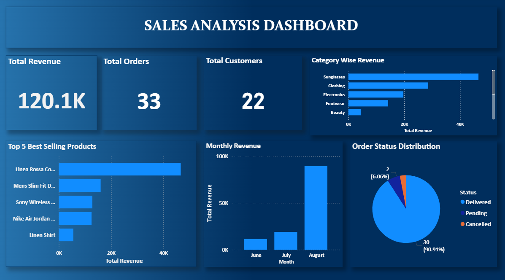

# Sales Analysis

## 📊 Project Overview
Designed and analysed an E-Commerce sales database using MySQL.
Connected data to Power BI and built an interactive sales dashboard.

## 🛠️ Tools Used
- MySQL — Database & Queries
- Power BI — Dashboard & Visualization
- GitHub — Version Control

## 📁 Tables Created
- Customers (22 records)
- Products (22 records)
- Orders (33 records)
- Order Items (41 records)

## 📈 Analysis Performed
- Total Revenue Generated
- Day-wise & Monthly Sales Report
- Top 5 Best Selling Products
- Category-wise Revenue
- Customer-wise Purchase Summary
- Order Status Distribution
- Monthly Revenue Growth
- Repeat Customers Analysis
- Dead Stock Check

## 🖥️ Dashboard Preview

## 👤 Author
Christopher Kevin C
MIS Executive
